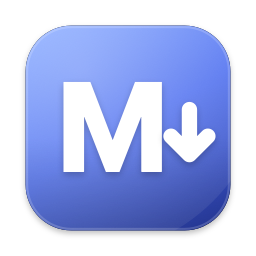
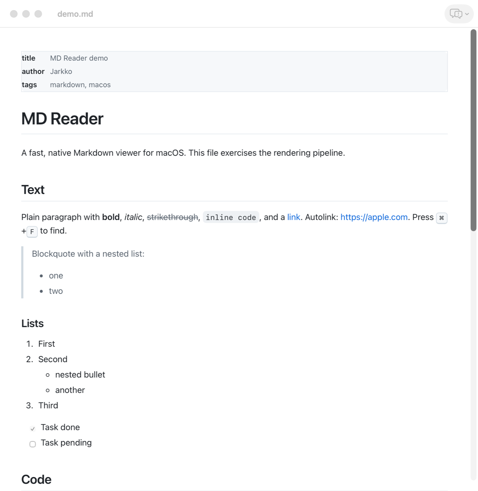

<p align="center">
  
</p>

<h1 align="center">MD Reader</h1>

<p align="center">
  A fast, native Markdown viewer for macOS.<br>
  Double-click a <code>.md</code> file. Read it. That's it.
</p>

<p align="center">
  <a href="https://github.com/ljack/macos-md-reader/releases/latest"></a>
  
  
  
  
</p>

<p align="center">
  
</p>

---

## Install

```bash
brew install --cask ljack/tap/md-reader
```

Or download `MD-Reader-<version>.zip` from the [latest release](https://github.com/ljack/macos-md-reader/releases/latest), unzip, drag to Applications. The app is Developer ID signed and notarized, so it opens without Gatekeeper warnings.

On first launch MD Reader offers to become your default Markdown viewer. You can change that any time from **MD Reader ▸ Make Default Markdown Viewer…**

## Why

macOS has no built-in way to *read* Markdown. Quick Look shows raw text. Editors are heavy, slow to open, and want to edit when you only want to read. MD Reader is the missing piece: a viewer that opens instantly, renders like GitHub, and gets out of the way.

- **Fast.** Pure AppKit, no storyboards, no Electron, no SwiftUI startup cost. The app stays resident so the second file opens instantly.
- **Correct.** Rendering by [cmark-gfm](https://github.com/github/cmark-gfm), the same parser GitHub uses. Tables, task lists, footnotes, strikethrough, autolinks, raw HTML with GitHub's tag filter.
- **Native.** Document tabs, proxy icons, Open Recent, Open With, Services, print, full-screen, dark mode. It behaves like an Apple app because it is built like one.

## Features

### Reading

- GitHub-style typography with automatic light and dark mode.
- Syntax highlighting for fenced code blocks via highlight.js, with a hover-to-copy button.
- YAML front matter rendered as a compact metadata table.
- Heading anchors: `[link](#section)` works the way it does on GitHub.
- Relative images resolve next to the file. Relative `.md` links open in a new window or tab. External links open in your browser.
- ⌘F find with next / previous, ⌘+ / ⌘− / ⌘0 zoom (remembered), ⌘P print with sensible margins.

### Live reload

Edit the file in any editor and MD Reader updates in place, keeping your scroll position. The watcher is kqueue-based and survives atomic saves (write-to-temp-then-rename), so it works with Vim, VS Code, Obsidian, and friends.

### Windows and tabs

- **Merge All Windows** (⌥⌘M) collects every open document into one tabbed window.
- **Close All Windows** (⇧⌘W) does what it says.
- Standard tab navigation: ⌃⇥ / ⌃⇧⇥, Move Tab to New Window.

### Menu bar

A menu bar icon lists the last 100 Markdown files you opened. Click to reopen, hold ⌥ to reveal in Finder. For the current document: Reveal in Finder, Open Folder in Finder, Open in Terminal, Open in iTerm2. Toggle the icon with **Show in Menu Bar**.

### Feedback built in

The toolbar bubble (or **Help** menu) files a Bug, Feedback or Idea straight to this repo's issues. Paste a GitHub token once (kept in your Keychain) to post through the API; without one it opens a prefilled issue page in your browser. App version and document name are attached automatically if you want them.

## File types

MD Reader registers as a viewer for `net.daringfireball.markdown` and the extensions `.md .markdown .mdown .mkdn .mkd .mdwn .mdtxt .mdtext`, and as an alternate opener for plain text.

## Build from source

Requires Xcode 26 and [XcodeGen](https://github.com/yonaskolb/XcodeGen):

```bash
brew install xcodegen
git clone https://github.com/ljack/macos-md-reader.git
cd macos-md-reader
./Scripts/build.sh            # → build/MD Reader.app
./Scripts/build.sh --install  # also copies to /Applications
```

`xcodegen generate` produces `MDReader.xcodeproj` from `project.yml` if you prefer working in Xcode. Release builds sign with a Developer ID; local builds fall back to ad-hoc signing.

### Project layout

```
project.yml                        XcodeGen spec: target, Info.plist, SwiftPM deps
MDReader/Sources/
  main.swift                       NSApplicationMain, no nibs
  AppDelegate.swift                launch behaviour, global actions
  MenuBuilder.swift                main menu built in code, Open With
  MarkdownDocument.swift           read-only NSDocument, live reload, print
  DocumentWindowController.swift   window, toolbar, feedback sheet host
  PreviewViewController.swift      WKWebView host, link policy, zoom
  FindBar.swift                    ⌘F overlay
  MarkdownRenderer.swift           cmark-gfm → HTML, front matter
  HTMLTemplate.swift               page shell with bundled CSS/JS
  FileWatcher.swift                kqueue watcher
  WindowActions.swift              merge / close all
  StatusItemController.swift       menu bar icon
  RecentFilesStore.swift           last-100 list
  GitHubFeedback.swift             issue API, Keychain token
  FeedbackSheet.swift              Bug / Feedback / Idea sheet
  BuildInfo.swift                  provenance read from Info.plist
MDReaderTests/                     XCTest: renderer, front matter, recents
MDReader/Resources/
  preview.css, preview.js          theme, anchors, copy buttons
  highlight.min.js, github*.css    highlight.js 11.11.1
Casks/md-reader.rb                 Homebrew cask (mirrored to ljack/homebrew-tap)
Makefile                           gen / build / test / smoke / ci / install / bump / release
Scripts/
  build.sh                         build (and install)
  release.sh                       sign, notarize, staple, publish
  stamp-build.sh                   post-build: git commit → Info.plist
  smoke.sh                         launch test
  bump.sh                          version bump commit
  gen-icon.swift                   draws the app icon
.githooks/                         pre-commit hygiene, pre-push = make ci
AGENTS.md                          instructions for AI agents and contributors
```

### How it works

1. `MarkdownDocument` reads the file (UTF-8, falls back to encoding detection).
2. `MarkdownRenderer` strips front matter and runs cmark-gfm with the table, strikethrough, autolink, tasklist and tagfilter extensions.
3. `HTMLTemplate` wraps the HTML with the bundled stylesheet and scripts. The page is loaded once with the document's folder as base URL.
4. On file change the new HTML is pushed into the existing page over `evaluateJavaScript`, so scroll position and zoom survive.

## Local CI/CD

Everything runs on your Mac, no cloud runner needed.

```bash
make hooks     # once: pre-commit hygiene, pre-push runs the full CI
make ci        # build + 18 unit tests + launch smoke test
make bump V=0.2.0
make release   # sign, notarize, staple, GitHub release, cask + tap update
```

Every build stamps provenance into `Info.plist`: git commit (with `-dirty` when uncommitted), branch, UTC build date, and the commit count as build number. **About MD Reader** shows it with a link to the commit. Releases are cut only from clean trees, tagged at the exact commit, and the release notes carry the zip's sha256, which the Homebrew cask pins. So any installed copy can be traced back to its source.

Agents and contributors: see [AGENTS.md](AGENTS.md).

## Roadmap

- Table of contents sidebar
- Mermaid diagrams
- Source / rendered split view
- Quick Look extension

Ideas welcome. Use the feedback button in the app, it exists for exactly this.

## License

MIT. See [LICENSE](LICENSE).
